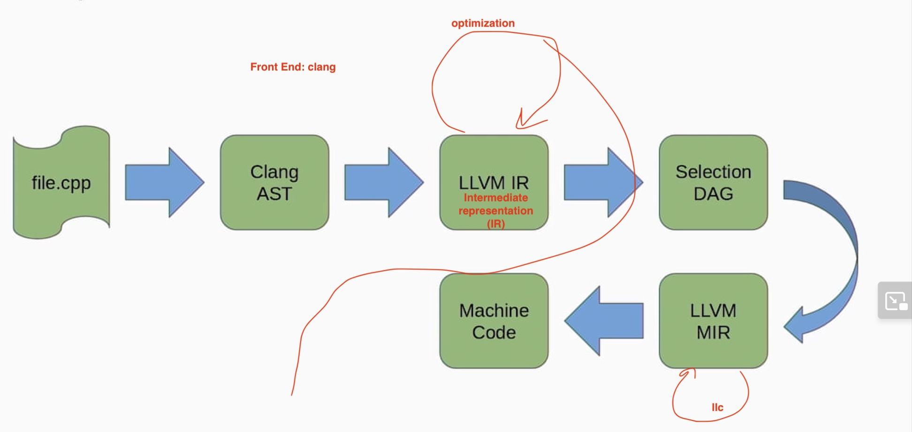
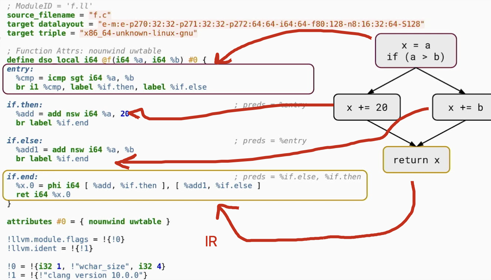
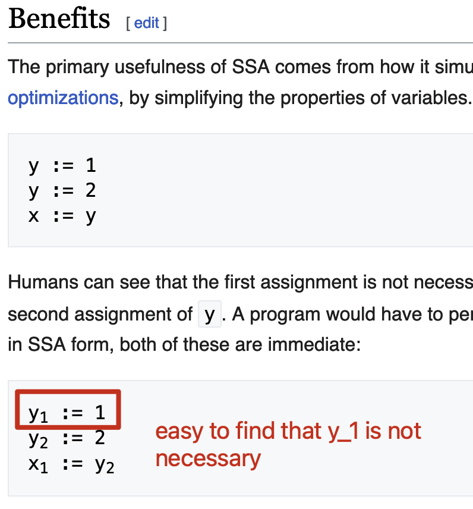
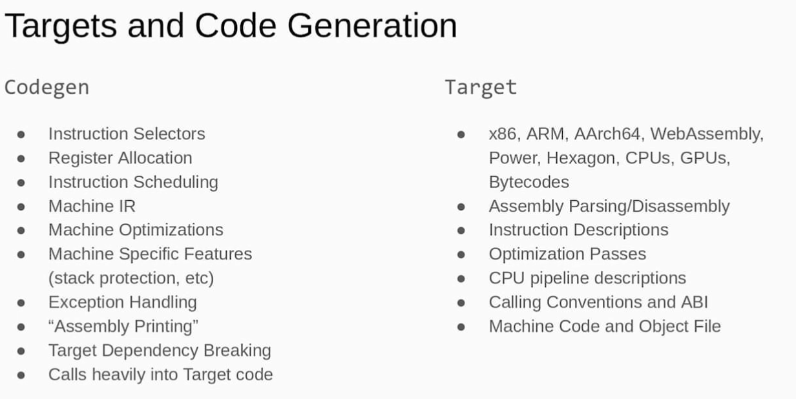

This is my note for [This LLVM Talk](https://www.youtube.com/watch?v=J5xExRGaIIY). This is a very beginning level note.

## Code
- LLVM monorepo: Now the [single source of truth](https://github.com/llvm/llvm-project) is now in github.
- Subdirectories:
  - Each one is a sub project.
  - The most famous one is `llvm-project/clang` (the "core")(front-end for C/C++/Cuda, etc)(what is front-end)
- Building: default building is debug build, and very slow
  - More on /GettingStarted.html

## Compilers
file.cpp -> Clang AST -> LLVM IR -> Selection DAG -> LLVM MIR -> Machine Code


- LLVM-IR

  - LLVM IR Hierarchy
    ```
    Module
        GlobalVariable
        Function
            BasicBlock
                Instruction
                    ICmpInst
                    BranchInst
    ```
  - assembly-like language always in SSA-from with infinite registers
    - [What is SSA: Static Single-assignment form](https://en.wikipedia.org/wiki/Static_single-assignment_form)
      - > In compiler design, static single assignment form (often abbreviated as SSA form or simply SSA) is a type of intermediate representation (IR) where each variable is assigned exactly once. SSA is used in most high-quality optimizing compilers for imperative languages, including LLVM, the GNU Compiler Collection, and many commercial compilers. 
      - 

- Target and Code Generation

    - Target
      - target means architecture the code is generated for: x86, ARM, powerPC etc.
      - SubTarget
        - Module level
        - Can choose only generate subtarget
    - Machine IR (MIR)
      - They are target dependent
      - produced out of llc program
        - [What is llc program](https://llvm.org/docs/CommandGuide/llc.html)
          - > The llc command compiles LLVM source inputs into assembly language for a specified architecture. The assembly language output can then be passed through a native assembler and linker to generate a native executable.The choice of architecture for the output assembly code is automatically determined from the input file, unless the -march option is used to override the default.
    - Instruction Selection and Register Allocation
      - [What is Instruction Selection](https://en.wikipedia.org/wiki/Instruction_selection)
        - > In computer science, instruction selection is the stage of a compiler backend that transforms its middle-level intermediate representation (IR) into a low-level IR. 
      - We have 3 instruction selectors
        - SelectionDAG
        - FastISel
        - GlobalISel


---

If you like my article and want to donate, click the [捐赠 Donation](https://mooxiu.github.io/donate/) button on the sidebar.