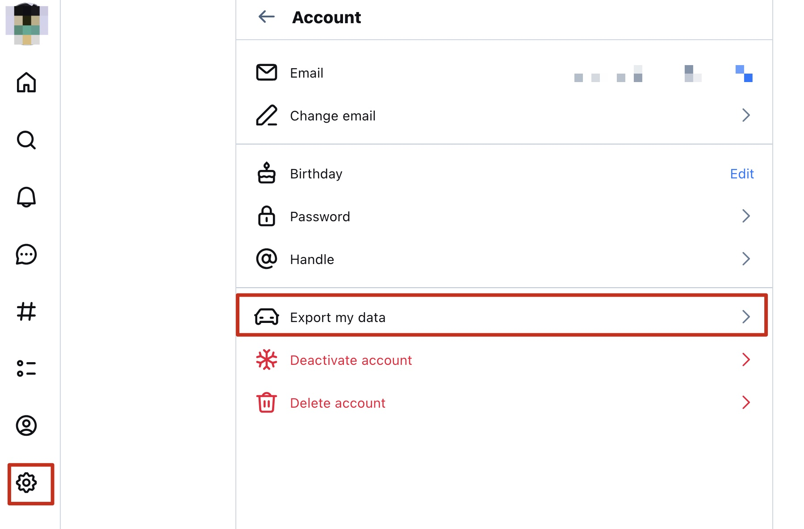

+++
title = "如何在从天竺(BlueSky)备份自己的数据"
date = "2025-01-03T17:55:10+09:00"

#
# description is optional
#
# description = "An optional description for SEO. If not provided, an automatically created summary will be used."

tags = ["BlueSky", "SNS", "天竺"]
+++

天竺[2]提供了便利的导出个人数据的方法，我相信这是号称开放的社交网络的必要条件。
我没有研究过mastodon的具体protocol，但是我所在的mastodon instance同样拥有导出个人数据的选项，而且相比于天竺要简单得多：导出的数据是一个tar.gz，里面是一些media file 和所有 Toots 的 json 文件。

## 范围
天竺导出的文件默认并不包含图片和多媒体信息，应该是基于使用权的考量。
而且除了支持导出自己的数据之外，也可以使用它的API去导出其他用户的公开数据。

## 方法
天竺所使用的 AT Protocol 对每一个用户赋予了一个DID，这是每个用户的唯一可识别码。
也就是说，除了显示的用户名，和一个可以自定义的handle之外，DID是每个用户不可更改的ID。
天竺的API正是通过在请求中携带DID去获取用户数据的。

需要注意的是，用户的DID并不是隐私信息，而且目前天竺[Currently, there are no private profiles on Bluesky](https://bsky.social/about/blog/5-19-2023-user-faq)，因此如果不想让其他人获取你的post，你最好不要发。
如何知道一个用户的DID参见[这里](https://docs.bsky.app/docs/advanced-guides/resolving-identities)，但这篇文章讲的是备份自己的数据，可直接在web UI上操作：



## 解析
天竺导出的文件格式为`.car`，可以通过官方提供的一个命令行工具进行解析：https://github.com/bluesky-social/cookbook/tree/main/go-repo-export

具体的做法是：

1. 安装Go
   
2. 安装命令行工具
```sh
go install github.com/bluesky-social/cookbook/go-repo-export@latest
```

3. 解析
```sh
go-repo-export unpack-records xxx.car
```
解析之后会生成一个文件夹，包含了个人的各种数据。
比较重要的是`app.bsky.feed.post`中每一个对每一个post都有一个独立的`.json`文件。


## Reference
[1] https://docs.bsky.app/blog/repo-export#the-repository-car-file
[2] 把BlueSky叫做天竺的来历：https://blog.yitianshijie.net/2024/11/18/twitter-shumei/

This is a page about »Bluesky_archive«.
