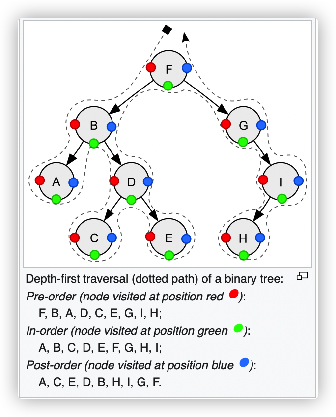

This is a memo about `Tree` structure. When dealing with `Tree` related problems in Leetcode, I try to write concise and clear code.

# Define the Structure
For a node in a tree, it can be described as :
```go
type TreeNode struct {
    Val int
    Left *TreeNode 
    Right *TreeNode 
}
```

# Traversal

There are 3 fundamental types of traversal. They are *Pre-Order Traversal*, *In-Order Traversal*, and *Post-Order Traversal*. *Order* is to describe the ranking of root node.

- *Pre-Order*(NLR): Node -> Left -> Right
- *In-Order*(LNR): Left -> Node -> Right
- *Post-Order*(LRN): Left -> Right -> Node 

See the diagram from [Wikipedia](https://en.wikipedia.org/wiki/Tree_traversal#In-order,_LNR) about tree traversal:


## Pre-Order

### Recursive
Recursive method is pretty straightforward:
```go
func preOrderTraversalRecursive(node *TreeNode) {
	if node == nil {
		return
	}
	// do with current node
	printNode(node)
	// do with left 
	preOrderTraversalRecursive(node.Left)
	// do with right	
	preOrderTraversalRecursive(node.Right)
}
```

### Iteration

We need a stack when using iteration method.

```go
func preOrderTraversalIteration(node *TreeNode) {
	stack := list.New()	
	curr := node
	for stack.Len() > 0 || curr != nil {
		if curr != nil {
			printNode(curr)	
			stack.PushBack(curr) // push element in the stack (add element to the back of the list)
			curr = curr.Left
		} else {
			back := stack.Back()
			curr = back.Value.(*TreeNode).Right
			stack.Remove(back)
		}
	}
}
```

## In-Order

### Recursive

```go
func inOrderTraversalRecursive(node *TreeNode) {
	if node == nil {
		return
	}
	// do with left node
	inOrderTraversalRecursive(node.Left)
	// do with current node
	printNode(node)
	// do with right node
	inOrderTraversalRecursive(node.Right)
}
```

### Iteration
// todo 

## Post-Order
### Recursive

```go
func postOrderTraversalRecursive(node *TreeNode) {
	if node == nil {
		return
	}
	// do with left node
	postOrderTraversalRecursive(node.Left)
	// do with right node
	postOrderTraversalRecursive(node.Right)
	// do with current node
	printNode(node)
}
```


### Iteration

# Binary Search Tree(BST, 不是BTS)

## Validation

A valid BST should satisfy following requirements:

- 


---

If you like my article and want to make a donation, you can click the [捐赠 Donation](https://mooxiu.github.io/donate/) button on the sidebar.
