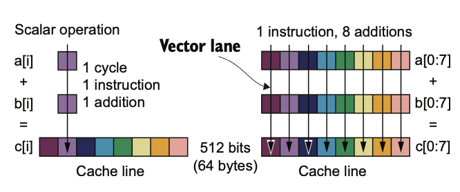
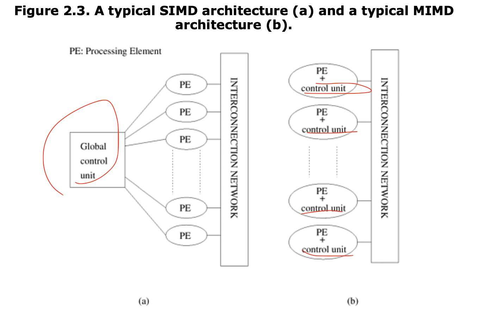
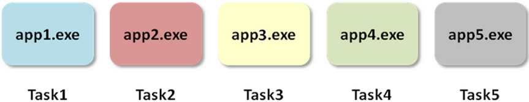
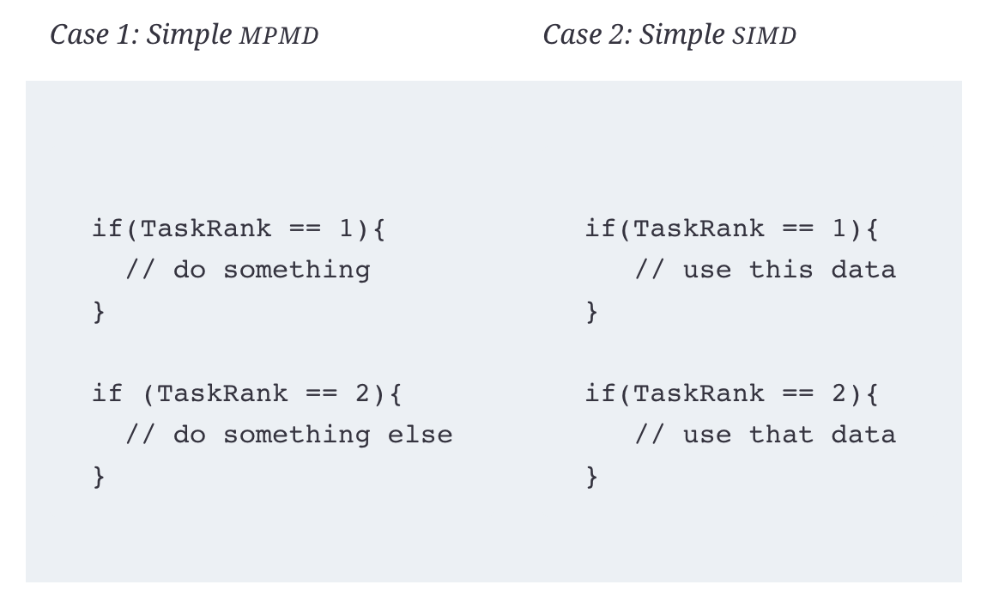
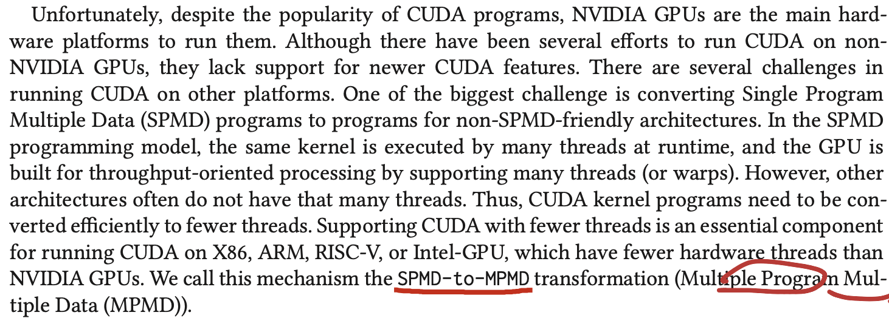

+++
title = "Remarks on concepts in Flynn's taxonomy"
date = "2024-11-04T00:43:02+09:00"

#
# description is optional
#
# description = "An optional description for SEO. If not provided, an automatically created summary will be used."

tags = ["computer science", "architecture", "HPC"]
+++

The so-called Flynn's taxonomy is proposed by Michael J. Flynn in his paper *Very high-speed computing systems* and *Some Computer Organizations and Their Effectiveness* published in 1970s.[1]

It categorizes computer architectures based on single/multiple instruction and single/multiple data into 4 types: SISD(Single Instruction Single Data), MISD(Multiple Instruction Single Data), SIMD(Single Instruction Multiple Data), MIMD(Multiple Instruction Multiple Data). The 4 acronyms are easy to get by simple combinations, but the key here is to understand their concepts and applications.

Only 2 of them are extremely common in the context of parallel computing: SIMD and MIMD. SISD, which means no parallel in this instruction level; as for MISD, one of the examples is do redundant computation on the same data, used in highly fault-tolerant approaches such as spacecraft controllers.[2]

### SIMD

The idea behind SIMD is *Vectorization*, it can group operations together in one. Following example shows the comparison between without and with vectorization on addition of 2 vectors `a[]` and `b[]`.



Scalar operation use one instruction and operate only one float number, while SIMD method can make 8 float number additions happen in the same time. The context is, due to some compiler and hardware support, the vector operation can be executed on a 512-bit vector and which means 8 64-bit float number.

The problem of SIMD is that it needs both support from compiler and hardware (Intel: MMX, SSE, SSE2; AMD: AVX). Also, if the application is memory bound, it has limited benefit. Given the difficulty to make SIMD work, the performance improvement can still not be ignored.[2]

There are a bunch of different ways to do SIMD operations in C++. As far as I know, we can use [SIMD directives of OpenMP](https://www.openmp.org/spec-html/5.0/openmpsu42.html) (from OpenMP 4.0), or use C++ intrinsics, it might be different for different compiler and hardware platforms, but [here is a guidebook for it](http://const.me/articles/simd/simd.pdf). Also chapter 6 in [2] has shown a lot of ways of doing SIMD.

> Note: SIMT(Single Instruction Multiple Threads) is a variant of SIMD, often used to describe GPU work group. ("Thank you", Nvidia 2008[4])

### MIMD

MIMD is actually more popular nowadays, even through SIMD has lower requirement on hardware (as it only needs one controller) and less requirement on memory (do not need to replicate instruction/program), SIMD requires specialized CPUs. We have actually seen a lot of such things happen, like distributed storage, cloud computing, GPU computing.

Computers in which each processing element is capable of executing a different program independent of the other processing elements are called multiple instruction stream, multiple data stream (MIMD) computers [3]. Specially, **Single Program Multiple Data (SPMD)** is a simple variant of MIMD.

This diagram shows the difference of SIMD and MIMD intuitively[3]:


In my understanding, the distributed nature of modern computing center also make MIMD much more popular and cheap. Even though I think the concepts of SIMD and MIMD are independent on the specific physical architecture of computer (share memory/UMA vs cluster/NUMA), but for a cluster, MIMD is often the only way to do.

I have experience in writing openMP and MPI parallelism programs in my coursework, I think both of them fall into the category of MIMD or even SPMD. When we're using openMP to parallel vectors addition in a shared memory computer (for example, my MacBook), it has no difference of manually creating threads and run. 

### MPMD?

Multiple Program Multiple Data (MPMD) is not a concept discussed in Flynn's Taxonomy, and I really suspect if it has been well-defined, as it does not have a Wikipedia entry and not found in reference books [2] and [3].

Nevertheless, we can easily derive the conception from SPMD: it can simply mean multiple programs running different data. Here are some comparisons[6]:


(MPMD)


(SPMD)

Here we should say that multiple programs can be different programs, this is what it distinguishes itself from SPMD. Actually, MPI programming model is sometimes referred to as MPMD[5].

- One example [7]:

In MPMD, the rank is to differentiate which process will do which work, and in SIMD, the rank is to differentiate which data each process will work on.

- Another example: ChatGPT told me MPMD is useful in heterogeneous computing systems or in workflows where different stages are performed on different processors.

But I encountered MPMD in wield context [8]. In the paper, the author aims to run CUDA program in different platform other than Nvidia GPU, and it says:


In my understanding, this transformation should be called **MPMD-to-SPMD** as it tries to run from CPU-GPU to CPU only.


### Thoughts

For a flat loop, can we make it nested to use SIMD and MIMD in the same time? For example:
```c
for (int i = 0; i < N; i++) {
    c[i] = a[i] + b[i]
}
```
Can we make it like this?
```c
// MIMD here, make it multi threads
for (int i = 0; i < N/inst_size; i++) {
    // SIMD here, 
    c[j: j+ inst_size]  =  simd_add([j: j+ inst_size], b[j: j+inst_size])
}
```


---
## Reference

[1]: [Flynn's taxonomy](https://en.wikipedia.org/wiki/Flynn%27s_taxonomy) 

[2]: R. Robey and Y. Zamora, “Parallel and High Performance Computing”.

[3]: A. Grama, Ed., Introduction to parallel computing, 2. ed., [Reprint.]. Harlow: Pearson, 2011.

[4]: E. Lindholm, J. Nickolls, S. Oberman, and J. Montrym, “NVIDIA Tesla: A Unified Graphics and Computing Architecture,” IEEE Micro, vol. 28, no. 2, pp. 39–55, Mar. 2008, doi: 10.1109/MM.2008.31.

[5]: [The MPI Programming Model](https://www.mcs.anl.gov/~itf/dbpp/text/node95.html)

[6]: https://support.moldex3d.com/2022/en/1-2-1-1_parallelapplications.html

[7]: Cameron Hughes and Tracy Hughes. 2003. Parallel and Distributed Programming Using C++. Prentice Hall Professional Technical Reference.

[8]: R. Han, J. Lee, J. Sim, and H. Kim, “COX : Exposing CUDA Warp-level Functions to CPUs,” ACM Trans. Archit. Code Optim., vol. 19, no. 4, pp. 1–25, Dec. 2022, doi: 10.1145/3554736.


This is a page about »Distinguish Some Acronyms«.
