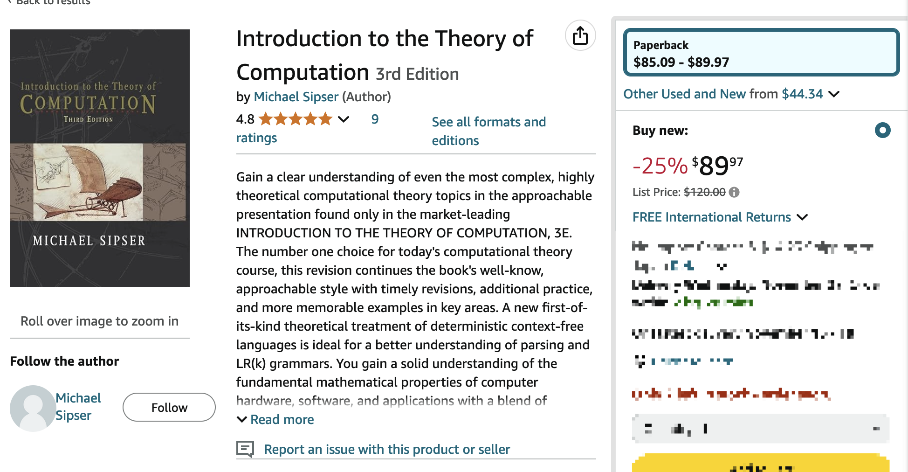
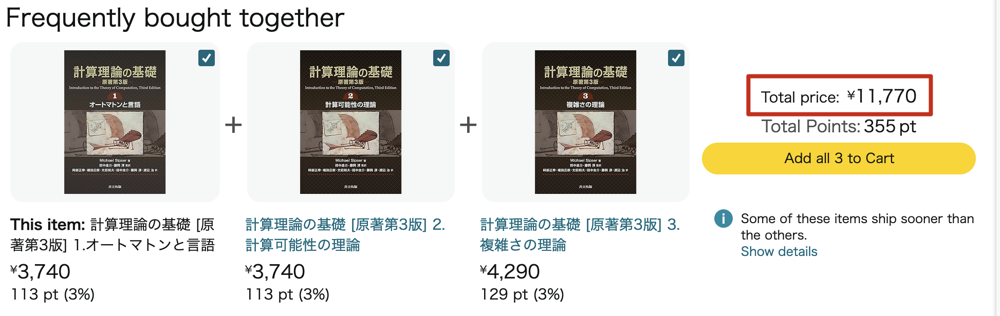
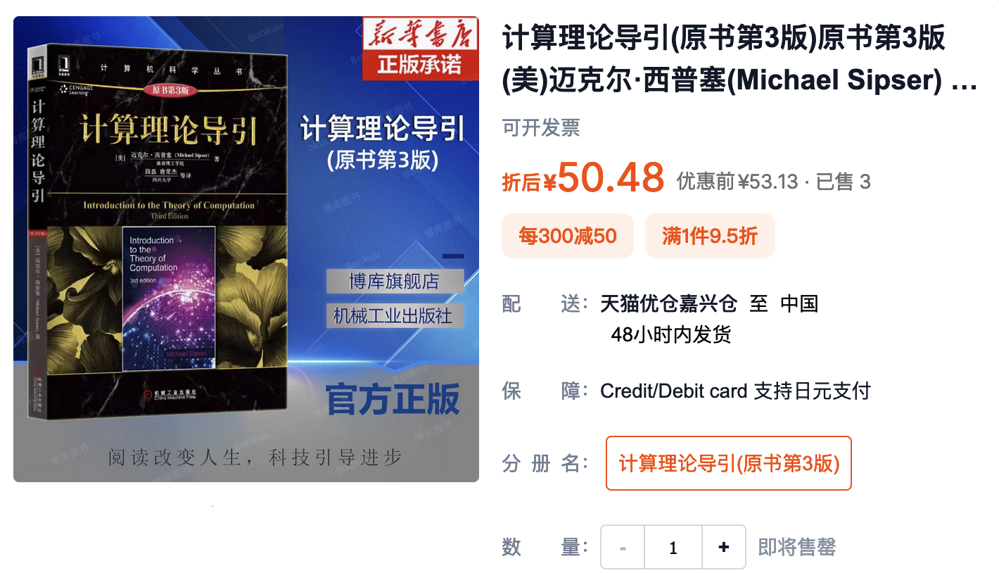
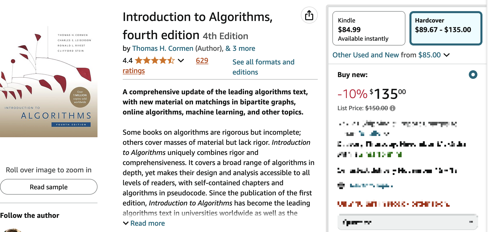
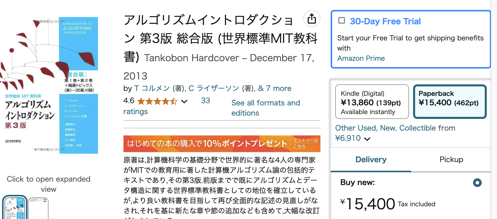
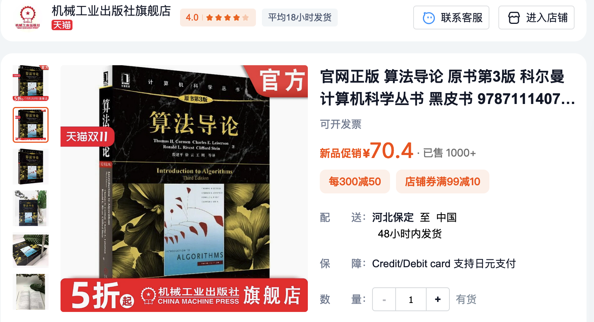

+++
title = "Books are so Expensive in Japan"
date = "2024-11-11T21:32:56+09:00"
draft = true

#
# description is optional
#
# description = "An optional description for SEO. If not provided, an automatically created summary will be used."

tags = ["DRM", "book", "price"]
+++

During my time in Japan, as a student in the past and now as a working professional, I’ve often been struck by how expensive books are here.

To illustrate my point, I’ll compare book prices in Japan, the US, and China. While acknowledging that there must be a lot of valid reasons behind these differences, I believe that the high cost of books in Japan can become a barrier for people seeking access to advanced knowledge and nurturing their creativity.

さあ、Let's compare the prices!

## Textbooks

Let's say you are a computer science student, and you want to learn computational theory well, except for selecting a related course, you also want to buy a good, classic textbook. You occasionally heard that *Introduction to the Theory of Computation* by professor *Michael Sipser* is a good one.

Here is the price in **amazon.com**(USA), that is **89.97 USD** after the discount.

The Japanese edition of the same book in Japan has been split to 3 separate books. In **amazon.co.jp**, that would cost **11770 JPY**.

Amazon has given up on Chinese domestic shopping business[1], so I took a screenshot of the same book in Taobao(Alibaba), which is one of the largest shopping websites in the country. The price is **50.48 CNY**.

--- 

How about another well-known classic, *Introduction to Algorithms* by *Thomas H. Cormen*? The 4th edition has already been published in the US, but has yet to come in Japan and China. I will compare using the latest edition in each country anyway.

Here are the screenshots:

US (4th edition, hardcover):

Japan (3rd edition, paperback):

China (3rd edition, paperback):

##  

---

## Reference:
[1]: https://www.nytimes.com/2019/04/18/technology/amazon-china.html

This is a page about »Expensive_information«.
