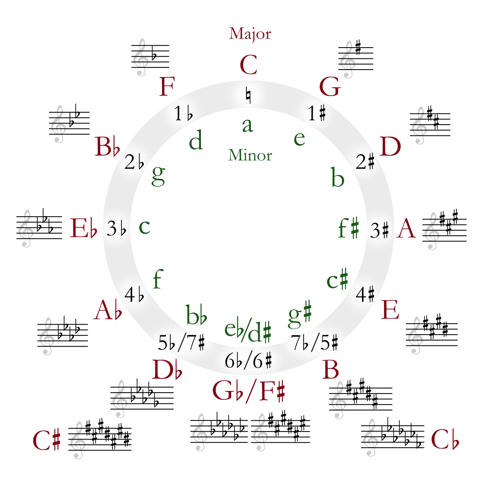

## 复习时间
### II->V->I
五级和弦（特别是属七和弦）有强烈的趋势接到一级和弦，最常见的**C**大调progression: 

```
Dm -> G7 -> C
```

从和弦级数上来说就是**II** -> **V** -> **I**.

因此从功能和声的角度来说，V是I的**Dominant Chord(属和弦)**

### Why
因为属和弦有非常不稳定的组合。

Take **G7** chord for an example. It is composed of: 
```
G, B, D, F
```

and between **B** and **F** is **6 halftone**, that is **3 whole tone**, and it sounds so discordant -- which makes us have a strong motivation to solve it to **Tonic Chord**.

Here we get the name: **Tritone** (that is 3 whole tone).


## 用法

### 副属和弦 (Secondery Dominant Chord)
In my understanding, the so-called **Secondary Dominant Chord** is the dominant chord of any chord. 我们把要到的和弦当作一级和弦，那它上面的五级和弦就是它的副属和弦。

For example, next progression:
```
C -> E7 -> Am
```
**E** is the 5th note of **A**, so **E7** is the dominant 7th chord of **Am**. 注意这里E7并不是C大调的和弦，也就是说，我们通过使用属和弦使用了一个离调的和弦。

副属和弦之递归：We can still add a chord between C and E7, that is **B7** (B is the 5th note of E):
```
C -> B7 -> E7 -> Am
```
and this trick goes on and on... Yes! it reminds us of **Circle of 5th(五度圏)**:




### 三全音代理（Tritone Substitution）
因为我们已经提炼出来Dominant 7th chord的tension来自于它的三全音，我们完全可以保留这个三全音，然后使用其他的和弦。例如G7和弦:
```
G B D F
```
我们保留它三全音的结构**B F**, 使用另外的和弦，比如**Db7**和弦：
```
Db F Ab Cb(B)
```
因此我们可以使用**Db7** 去替代 **G7**，也就是说**Db7** 也会有强烈的解决到 **C**的动机。

一个规律是三全音代理的和弦是目标和弦的高半音的Dominant 7th, 所以我们可以很快找到这样的一些选择：
```
Dm7 -> G7 -> CMaj7
```

我们可以在每一个和弦的前面接上它的三全音代理：
```
(Eb7) -> Dm7 -> (Ab7) -> G7 -> (Db7) -> CMaj7 
```

这个trick也被称为**替代属和弦**，或者**降二代五**（降二即高半音，代五指替代属和弦）。


## ref: 
- [很酷炫的「三全音代理」和弦！](https://www.youtube.com/watch?v=Wdn1acmup5g)
- [一招让你的属和弦与众不同——降二代五怎么用！](https://zhuanlan.zhihu.com/p/41952075)
- [一個降二代五 各自表述 - 爵士樂與黑樂中的表現方式不盡相同](http://www.chipinkaiyajazz.com/2019/01/blog-post_30.html)