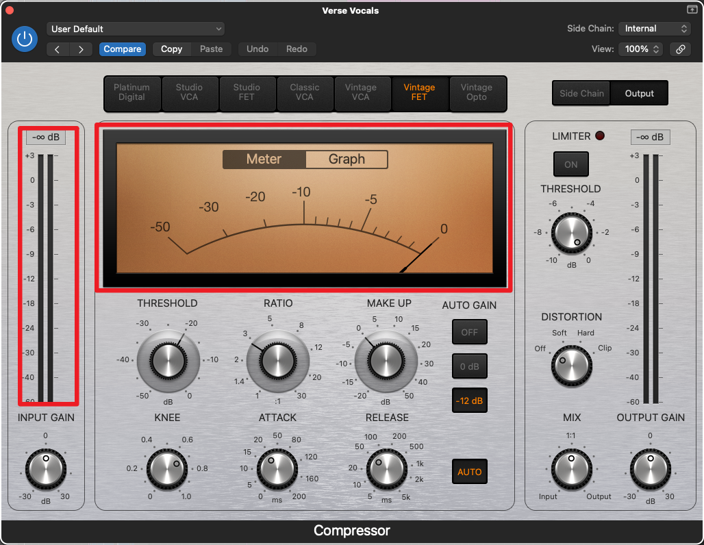

使用音频软件对音乐进行编辑的时候，我们几乎总是会注意到，在这些软件中，音乐的分贝总是一个负值(下面是一张compressor（压缩器）的截图，请注意红色方框中但分贝数字)：

这几乎和我们日常的经验截然不同，日常生活中，我们常能听到类似以下的描述：

> 人耳最好不要长期曝露在xx分贝之下

或者

> 施工的声音大约是xx分贝

dB（分贝），似乎是我们都很熟悉很基本的对声音大小进行衡量的单位，但此时跟在一个负值后面的它显得如此陌生。事实上，前面一句话的「对声音大小进行衡量的单位」这句话就非常模糊，何谓声音大小？如果两个人的耳朵对于同样的声音有着不同的敏感度的话，那么这个声音对于两个人的声音大小是不同的吗？一旦有诸如此类的问题，我们就会发现对声音大小（响度）进行描述的物理单位似乎需要被更严谨地定义。

---

If you like my article and want to make a donation, you can click the [捐赠 Donation](https://mooxiu.github.io/donate/) button on the side bar.