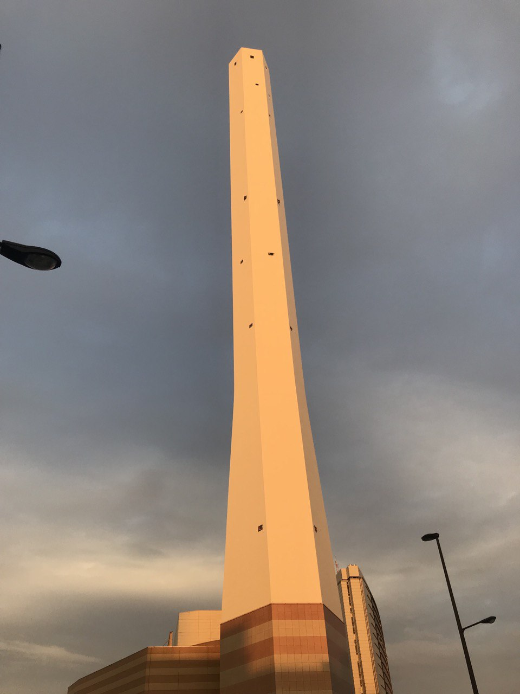
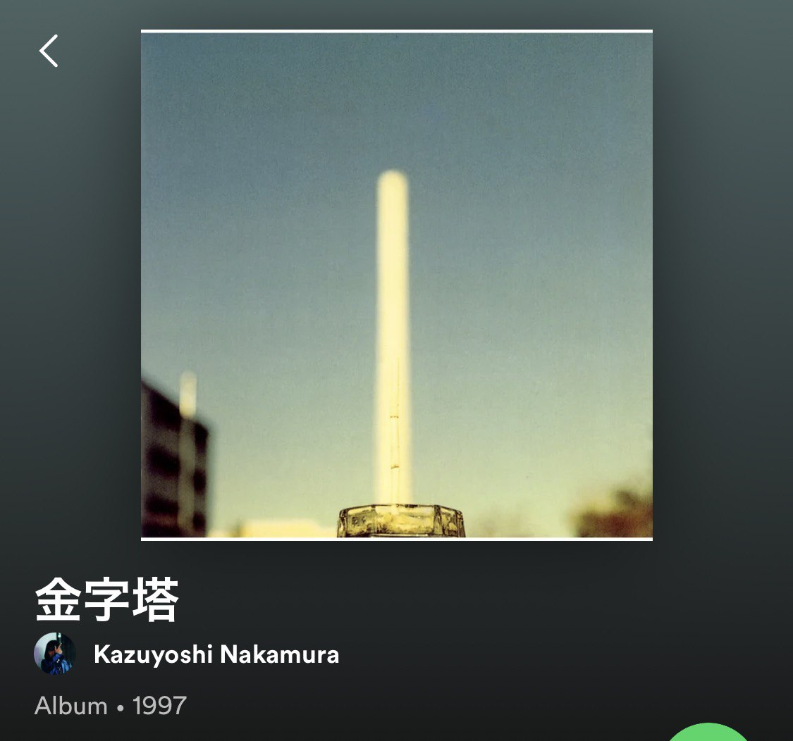
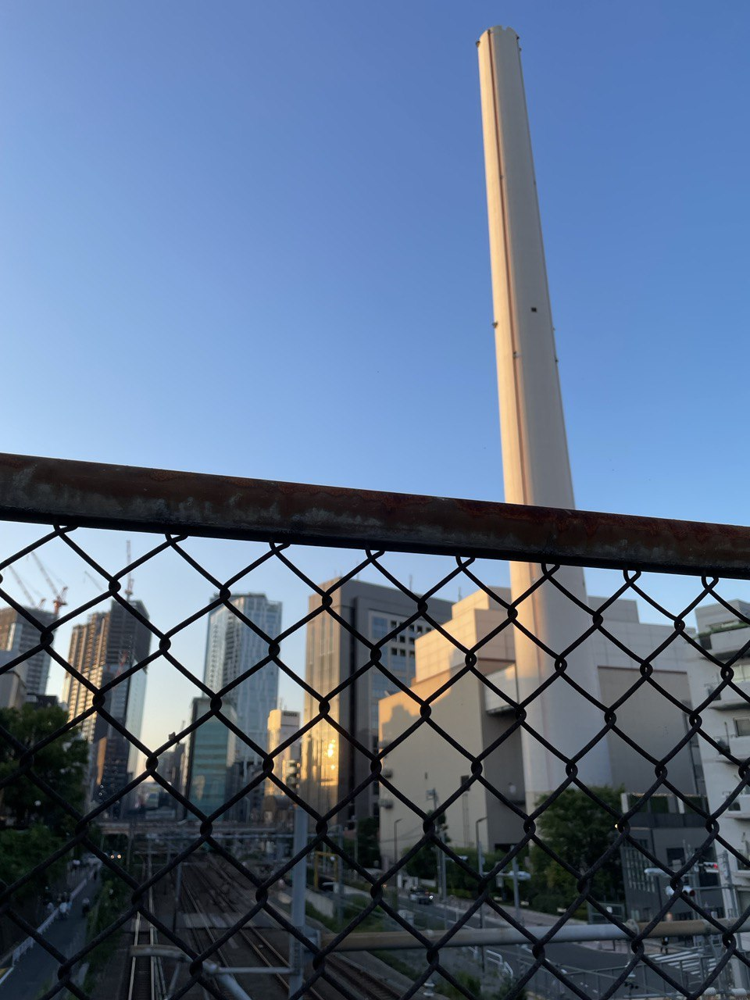
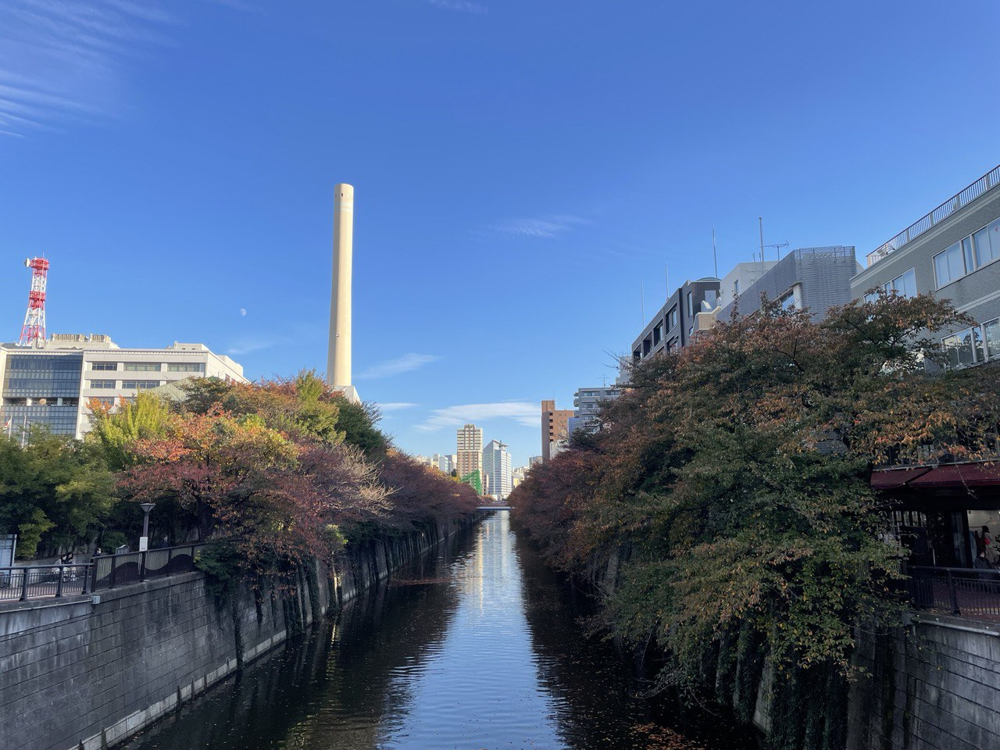

几年前我路过池袋的时候，就惊讶于这么一座不明所以的白色的塔，应该有个名字吧。但我一直没有特别去查，因为位于池袋北口（也就是现在的池袋西口北），我一直在心里称之为「池袋北塔」：

---

后来我在spotify上看到了这么一张专辑推荐，封面的塔和我认识的池袋北塔非常相似，我心想这应该就是池袋北塔吧，说不定是什么有名的地标：

---

最近散步走到惠比寿和涩谷交界的地方的时候，也看到了类似的塔。一开始远远看过去，我心想这不会是池袋塔吧，但是走进了才发现这是涩谷塔。我决定查一下地图，地图上对此的标识是「渋谷清掃工場」。我心想不会吧，在我心中留下如此憧憬的东西居然是一个垃圾清扫工厂，直到我走到塔下确认了铁栅栏外面的铭牌才确定，这就是垃圾处理工厂：

---

家附近也能看到一座这样的塔，我之前以为就是上图的涩谷垃圾工厂，没想到是目黑垃圾工厂：

刚刚Spotify又给我推送了上面那张专辑，于是我搜索了一番，果然也是垃圾处理工厂，根据描述，这座江户垃圾处理工厂由于改建已经在前年解体，新的塔要在令和九年才能完成：



---

If you like my article and want to donate, click the [捐赠 Donation](https://mooxiu.github.io/donate/) button on the sidebar.